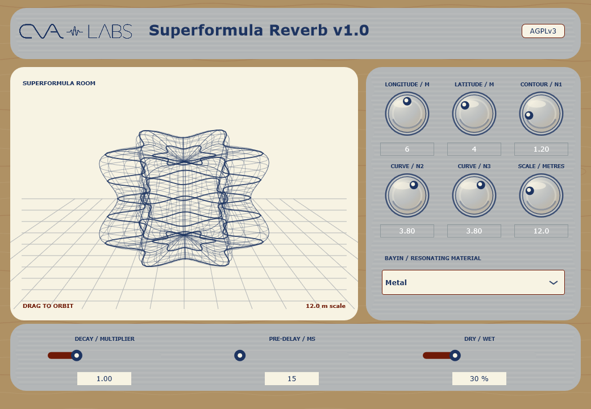

# Superformula Reverb

Superformula Reverb is a geometry-driven VST3 effect by CVA Labs. Its room shape is generated from the 3D spherical product of two Gielis superformulas. Editing the visible shape also changes the delay paths and character of the reverb.



## Features

- Interactive 3D room display with mouse orbit
- Independent longitude and latitude symmetry controls
- Gielis `N1`, `N2`, and `N3` contour controls
- Geometry-derived fractional delay paths
- Eight Bayin material voices: Metal, Stone, Silk, Bamboo, Gourd, Clay, Hide, and Wood
- Room scale, decay, pre-delay, and dry/wet controls
- Stereo and mono processing
- Host automation and project-state recall
- Windows x64 and macOS Universal VST3 releases

## Acoustic model

The processor uses an eight-line orthogonal Hadamard feedback delay network. Radial samples from the displayed spherical-product surface determine travel distances at 343 m/s. Each Bayin material voice applies a designed reflection-loss and damping profile.

This is a creative algorithmic reverb. It is not a ray tracer, wave simulation, or a model based on measured absorption coefficients.

## Installation

### Windows

Extract the release archive and copy the complete `Superformula Reverb.vst3` directory to:

```text
C:\Program Files\Common Files\VST3
```

Rescan plugins in your DAW.

### macOS

Extract the release archive and copy `Superformula Reverb.vst3` to either:

```text
~/Library/Audio/Plug-Ins/VST3
```

or the system-wide directory:

```text
/Library/Audio/Plug-Ins/VST3
```

The macOS build is unsigned and not notarized. On first use, macOS may require approval in **System Settings → Privacy & Security**. Rescan plugins in your DAW after installation.

## Building from source

Requirements:

- CMake 3.22 or newer
- JUCE 8.0.10, fetched automatically when `JUCE_PATH` is not supplied
- Visual Studio with C++ tools on Windows
- Xcode command-line tools on macOS

Windows:

```powershell
./Build.ps1 -JucePath C:/path/to/JUCE
```

macOS:

```bash
cmake -S . -B out -DCMAKE_BUILD_TYPE=Release -DCMAKE_OSX_ARCHITECTURES="arm64;x86_64"
cmake --build out --config Release --parallel
ctest --test-dir out -C Release --output-on-failure
```

The VST3 bundle is created under `out/SuperformulaReverb_artefacts/Release/VST3/`.

## References

- [Johan Gielis superformula and spherical product examples](https://paulbourke.org/geometry/supershape/)
- [Bayin material classification](https://www.macaumuseum.gov.mo/en/collections/95258?AspxAutoDetectCookieSupport=1)
- [JUCE 8.0.10](https://github.com/juce-framework/JUCE/tree/8.0.10)

## License

Copyright © 2026 CVA Labs.

Superformula Reverb is free software licensed under the [GNU Affero General Public License v3.0](LICENSE). It uses JUCE under the terms of the AGPLv3. See [NOTICE](NOTICE.md) for dependency and asset information.
